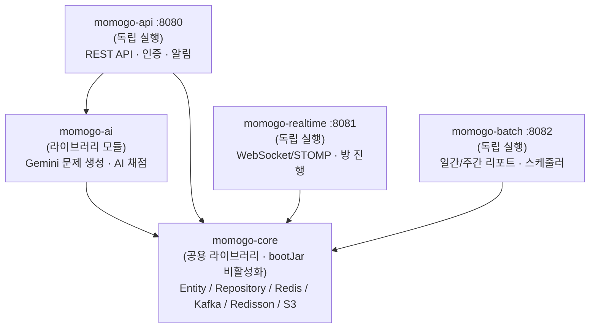

<div align="center">


# MoMoGo (모모고)

**모여서 모의고사** — 실시간으로 함께 응시하고 AI가 채점하는 온라인 모의고사 플랫폼

[](https://github.com/MoMoGo-QuizPlatform/MoMoGo/actions/workflows/ci.yaml)
[](https://github.com/MoMoGo-QuizPlatform/MoMoGo/actions/workflows/deploy-production.yml)

[서비스 바로가기](https://momogo.kro.kr/) · [기획 문서 (Notion)](https://app.notion.com/p/ohgiraffers/MoMoGo-37d649136c1180509d0ce699299a0d82)

</div>

<br/>

## 👑 팀 소개

|  |  |  |  |
|:---:|:---:|:---:|:---:|
| **선웅제** | **이재준** | **최준영** | **홍성휘** |
| [@idktomorrow](https://github.com/idktomorrow) | [@jaejo](https://github.com/jaejo) | [@Junkov0](https://github.com/Junkov0) | [@SungHuii](https://github.com/SungHuii) |
| 알림(SSE) · 배치/스케줄러 | 유저 · JWT/Security · 슈퍼어드민 | AI 문제 생성 · 문제 은행 | 웹소켓 · 공간(Space) · 방(Room) · AI 답안 채점 |

<br/>

## 📌 프로젝트 개요

여러 명이 같은 시간에 접속해 함께 모의고사를 응시하고, 제출과 동시에 채점 결과와 리포트까지 받아볼 수 있는 실시간 퀴즈/모의고사 플랫폼입니다. 문제 출제는 AI(Gemini)가 보조하고, 채점 역시 AI 채점과 수동 채점을 함께 지원합니다.

- **기간**: 2026-06-22 ~ 2026-08-13
- **인원**: 4명 (Backend)
- **배포**: [https://momogo.kro.kr](https://momogo.kro.kr/)

<br/>

## 🧩 멀티모듈 아키텍처

이번 프로젝트에서 **처음으로 Gradle 멀티모듈 구조**를 적용했습니다. 실시간 웹소켓(방 진행), REST API, 배치(리포트 집계), AI 채점처럼 트래픽 패턴과 장애 영향 범위가 서로 다른 워크로드를 하나의 애플리케이션으로 묶지 않고, **독립적으로 배포·재시작·확장 가능한 단위**로 분리하는 것이 목표였습니다.



### 모듈별 책임

| 모듈 | 역할 | 실행 형태 |
|---|---|---|
| `momogo-core` | 도메인 Entity, Repository(QueryDSL), Redis/Kafka/Redisson 등 공용 인프라 설정 | `jar` (라이브러리, `bootJar` 비활성화) |
| `momogo-ai` | Spring AI 기반 Gemini 연동 — 문제 생성, 답안 AI 채점 | `jar` (라이브러리, `momogo-api`에 의존성으로 포함) |
| `momogo-api` | 인증(JWT/OAuth2), 문제, 공간, 알림(SSE), 슈퍼어드민 등 REST API | `bootJar` (독립 서비스, 8080) |
| `momogo-realtime` | WebSocket/STOMP 기반 실시간 방(Room) 진행, Redis Pub/Sub 라우팅 | `bootJar` (독립 서비스, 8081) |
| `momogo-batch` | Spring Batch + ShedLock 기반 개인/공간 리포트 집계 스케줄러 | `bootJar` (독립 서비스, 8082) |

### 설계 원칙 & 이유

- **의존 방향 단일화**: `api` / `realtime` / `batch`는 오직 `core`만 의존하고 서로를 참조하지 않습니다. `ai`도 `core`만 의존하며, 문제 생성 API 호출이 필요한 `api`만 `ai`를 의존합니다. → 순환 의존 없이 각 모듈이 독립적으로 컴파일·테스트 가능
- **`core`는 순수 라이브러리**: `bootJar { enabled = false }` / `jar { enabled = true }`로 설정해 실행 가능한 애플리케이션이 아닌 공용 코드 묶음으로만 존재하도록 강제
- **장애 격리 & 개별 스케일링**: 실시간 웹소켓 서버(`realtime`)에 트래픽이 몰리거나 장애가 나도 REST API(`api`)나 배치(`batch`)는 영향받지 않음. 배포도 EC2에 3개의 독립 프로세스(systemd 서비스)로 분리 운영
- **선택적 CI/CD**: 배포 파이프라인에서 `dorny/paths-filter`로 변경된 경로를 감지해, 백엔드가 바뀌면 `api.jar`/`realtime.jar`/`batch.jar` 중 필요한 것만 빌드·S3 업로드·SSM 재시작하고, 프론트만 바뀌면 백엔드 빌드는 건너뜁니다.
- **루트 Gradle 공통화**: 루트 `build.gradle`의 `subprojects {}` 블록에서 Lombok, MapStruct, JUnit5, JaCoCo 등 공통 설정을 일괄 적용하고, 루트 `jacocoTestReport` 태스크가 5개 서브모듈의 커버리지를 하나의 통합 리포트로 집계합니다.

<br/>

## 🛠️ 기술 스택

### Language & Framework


### Realtime & Messaging


### Database


### AI


### Frontend


### Cloud & Deploy


### Monitoring


### Load Test


<br/>

## 🔍 구현 기능 상세

### **최준영 — AI 문제 생성 · 문제 은행**

<details>
<summary>AI 문제 생성 (Spring AI + Gemini)</summary>

- `momogo-ai` 모듈에서 Spring AI Google GenAI 스타터로 Gemini 연동
- 카테고리 기반 문제 세트 자동 생성 (`ProblemGenerationServiceImpl`)
- 생성된 문제는 `momogo-core`의 `Problem`, `ProblemCategory` 엔티티로 영속화

</details>

<details>
<summary>문제 은행 CRUD & 카테고리 관리</summary>

- 문제 등록/수정/삭제, 카테고리 CRUD 엔드포인트 구현
- 슈퍼어드민 전용 문제/카테고리 관리 API 제공

</details>

<br/>

### **홍성휘 — 웹소켓 · 공간(Space) · 방(Room) · AI 답안 채점**

<details>
<summary>실시간 방(Room) 진행 (WebSocket/STOMP)</summary>

- `momogo-realtime` 모듈에서 STOMP 프로토콜 기반 실시간 방 진행 처리
- Redis Pub/Sub로 멀티 인스턴스 환경에서 방 상태를 전역 브로드캐스팅
- JWT 기반 STOMP 채널 인터셉터로 웹소켓 연결 인증 처리

</details>

<details>
<summary>답안 제출 파이프라인 (Kafka + Redisson + Redis Claim Marker)</summary>

- 답안 제출을 Kafka 비동기 처리로 전환해 메인 트랜잭션과 분리
- `DistributedLockExecutor`로 Redisson 분산락 관심사를 도메인 서비스에서 분리
- Redis `setIfAbsent` 기반 제출 클레임 마커로 중복 제출을 검증 이후 시점에 선점 → 클레임 유실 방지
- Kafka 프로듀서 전송 실패 시 클레임 키를 보상 삭제하고, 파티션 키를 `roomId:userId`로 구성해 컨슈머 부하를 고르게 분산
- 컨슈머에서 `isAttended` 사전 체크로 트랜잭션 rollback-only 오류를 방지

</details>

<details>
<summary>AI 답안 채점 (Kafka 비동기)</summary>

- 방(Room) 제출 마감 시 Kafka `ai-grading-events` 토픽으로 채점 시작 이벤트 발행
- `AiGradingEventListener`가 해당 방의 전체 응시자 답안을 조회해 Gemini `ChatClient`로 비동기 채점
- 채점 대상이 없는 경우 등 예외 상황에서 방의 AI 채점 상태를 복구하는 방어 로직 포함

</details>

<details>
<summary>공간(Space) 관리</summary>

- 스터디/그룹 단위인 공간(Space) 생성 및 관리 API 구현

</details>

<br/>

### **이재준 — 유저 · JWT/Security · 슈퍼어드민**

<details>
<summary>인증/인가</summary>

- JWT 기반 Stateless 인증 및 OAuth2 소셜 로그인 연동
- `momogo-api`의 Spring Security 설정 및 인증 관련 컴포넌트 구현

</details>

<details>
<summary>유저 (마이페이지 · 프로필)</summary>

- 회원가입, 내 정보 조회(`/api/users/me`) API 구현
- 프로필(이름, 비밀번호, 프로필 이미지) 수정 — `momogo-core`의 S3 업로드/이미지 리사이징 유틸 연동
- 같은 공간(Space)에 소속된 유저 목록 조회 — 방(Room) 응시 대상자 지정 등에 사용

</details>

<details>
<summary>슈퍼어드민</summary>

- 유저 정지(Ban), 문제/카테고리, 공간 등 플랫폼 전반을 관리하는 슈퍼어드민 전용 API 구현
- `@PreAuthorize` 기반 권한 검증 적용

</details>

<br/>

### **선웅제 — 알림(SSE) · 배치/스케줄러**

<details>
<summary>실시간 알림 (SSE)</summary>

- Kafka로 알림 이벤트를 발행/구독한 뒤 SSE(Server-Sent Events)로 클라이언트에 실시간 푸시
- `NotificationEmitterRegistry`로 인스턴스별 SSE 커넥션 관리, Redis Pub/Sub로 멀티 인스턴스 간 알림 라우팅
- 하트비트 스케줄러로 로드밸런서의 커넥션 타임아웃 방지

</details>

<details>
<summary>배치 & 스케줄러 (Spring Batch + ShedLock)</summary>

- 개인/공간 단위 일간·주간 리포트를 집계하는 배치 Job 구현 (`PersonalReportBatchJobConfig`, `QuizBatchJobConfig`)
- ShedLock(Redis 기반)으로 다중 인스턴스 환경에서 배치/스케줄러 중복 실행 방지
- 만료 유저 정리 등 정기 스케줄러 구현

</details>

<br/>

## 🌎 인프라 & 배포

- **로컬 인프라**: `docker-compose.yml`로 Redis, Kafka(KRaft), Kafka UI, Prometheus, Grafana 실행
- **배포(CD)**: GitHub Actions `CD` 워크플로 → 변경 경로 감지(`paths-filter`) → 백엔드/프론트엔드 중 변경된 부분만 빌드 → S3 업로드 → AWS SSM으로 EC2 인스턴스에 원격 명령 전달
  - 백엔드는 `momogo-api` / `momogo-realtime` / `momogo-batch` 3개의 jar가 각각 별도 systemd 서비스로 배포·재시작됨
  - 프론트엔드는 빌드 산출물을 Nginx가 정적 서빙
- **모니터링**: Actuator + Micrometer로 Prometheus 메트릭 수집, Grafana로 시각화

### 인프라 진화 (1차 → 4차)

부하 테스트로 성능/비용을 검증해가며 인프라를 4단계에 걸쳐 재구성했습니다.

| 단계 | 인프라 구성 | 처리 방식 | 비고 |
|---|---|---|---|
| **1차** | EC2 단일 인스턴스 + AWS RDS PostgreSQL | 동기 처리 (Kafka 도입 전) | Baseline |
| **2차** | EC2 단일 인스턴스(자원 제한) + Neon Serverless Postgres | 동기 처리 | DB를 Neon으로 전환 |
| **3차** | EC2 4대(App/Realtime 다중 인스턴스) + RDS PostgreSQL | Kafka/Redis 도입, 비동기 처리 | 단일 → 분산 아키텍처 전환 |
| **4차** | EC2 3대(App 1·2 + LB) + Neon Serverless Postgres, Redis/Kafka는 EC2 2번에 Docker로 통합 | 비동기 처리 유지 | 독립 Kafka EC2 중지 + App 1 다운사이징 |

- 3차에서 Kafka/Redis 도입과 다중 인스턴스 분산이 함께 이뤄져 실패율이 크게 개선됐고(알림 API 기준 Load 26%→0%대), 4차에서는 성능을 유지한 채 독립 Kafka EC2를 중지하고 미들웨어를 Docker로 통합, DB를 Neon Serverless로 이관해 자원 사용량을 줄였습니다.
- 4차 환경에서도 답안 제출 API는 24,753건 부하에서 5xx 에러 0건, 로그인 API는 극한 부하(VU 500)에서 `BoundedBCryptPasswordEncoder` 세마포어 기반 `503 Fast-Fail`로 서버 다운 없이 방어함을 k6로 검증했습니다.

#### 실제 결제액 vs 크레딧 소진액

카드로 실제 결제된 금액은 **전 구간 $0**입니다. AWS Cost Explorer를 `RECORD_TYPE`(Usage/Credit)으로 분해해보면, EC2·RDS·ElastiCache 사용량에 대해 매일 정가(`Usage`)가 청구되고 AWS 프리티어/크레딧이 동일 금액을 `Credit`으로 즉시 상쇄합니다. 즉 아래 금액은 **실제로 빠져나간 돈이 아니라, 매일 소진된 크레딧(=정가 상당액)을 월 단위로 환산한 값**입니다.

| 단계 | 관측 구간 | 일 평균 소진 크레딧 | 월 환산 | 직전 단계 대비 |
|---|---|---|---|---|
| 1차 | 07-26 ~ 07-30 (5일) | $2.72/일 | **약 $81.7/월** | Baseline |
| 2차 | 07-31 ~ 08-04 (5일, 안정 구간) | $1.90/일 | **약 $56.9/월** | **-$24.8/월 (-30.3%)** |
| 3차 | 08-10 ~ 08-11 (2일) | $7.72/일 | **약 $231.5/월** | (3차는 다중 인스턴스+RDS 복구로 재상승) |
| 4차 | 08-12 (1일) | $5.46/일 | **약 $163.8/월** | **-$67.7/월 (-29.3%)** |

- 1차→2차: RDS→Neon Serverless 전환만으로 크레딧 소진액이 하루 **$2.72 → $1.90**, 월 환산 **약 $81.7 → $56.9 (약 $24.8 절감, -30.3%)**
- 3차→4차: 독립 Kafka EC2 중지 + App 1 다운사이징(t3.medium→t3.small) + Neon 재전환으로 하루 **$7.72 → $5.46**, 월 환산 **약 $231.5 → $163.8 (약 $67.7 절감, -29.3%)**
- 3차·4차는 관측 가능한 날짜가 각 2일/1일뿐이라(전환 당일 신·구 리소스가 겹쳐 잡히는 등 노이즈 가능) 1차·2차(5일 평균)보다 신뢰도가 낮습니다. 08-13 데이터는 Cost Explorer 정산 지연으로 $0으로 잡혀 위 평균에서 제외했습니다.

<br/>

## 📈 프로젝트 구조

<details>
<summary>프로젝트 구조</summary>

```markdown
.
├── .github/workflows/          # CI, 배포 파이프라인
├── db/                         # 스키마 SQL (schema.sql, batch-schema.sql)
├── docker-compose.yml          # Redis / Kafka / Prometheus / Grafana
├── k6/                         # 부하 테스트 시나리오 (load/stress/spike/soak)
├── momogo-core/                # 공용 라이브러리 모듈
│   └── src/main/java/com/momogo/core/
│       ├── common/             # config, exception, lock, security, storage
│       └── domain/             # notification, problem, report, room, space, user
├── momogo-ai/                  # AI 문제 생성 · 채점 모듈 (라이브러리)
│   └── src/main/java/com/momogo/ai/
│       ├── grading/
│       └── problem/
├── momogo-api/                 # REST API 서비스 (:8080)
│   └── src/main/java/com/momogo/api/
│       ├── auth/ common/ notification/ problem/ report/ room/ space/ superadmin/ user/
├── momogo-realtime/             # WebSocket/STOMP 서비스 (:8081)
│   └── src/main/java/com/momogo/realtime/
│       ├── quiz/ websocket/
├── momogo-batch/                # 배치/스케줄러 서비스 (:8082)
│   └── src/main/java/com/momogo/batch/
│       ├── config/ job/ scheduler/
└── momogo-frontend/              # React + TypeScript + Vite
    └── src/
        ├── pages/ services/ styles/ types/
```

</details>

<br/>

## 🚀 로컬 실행

```bash
# 1. 인프라 실행 (Redis, Kafka, Prometheus, Grafana)
docker-compose up -d

# 2. 백엔드 (모듈별 개별 실행)
./gradlew :momogo-api:bootRun       # :8080
./gradlew :momogo-realtime:bootRun  # :8081
./gradlew :momogo-batch:bootRun     # :8082

# 3. 전체 모듈 빌드
./gradlew build

# 4. 프론트엔드
cd momogo-frontend
npm install
npm run dev
```

<br/>

## ✅ 테스트 & 품질

- **CI**: PR마다 GitHub Actions `CI` 워크플로에서 5개 서브모듈 전체 빌드 검증(`./gradlew build`)
- **부하 테스트**: k6로 담당 도메인별 API에 대해 load/stress/spike/soak 시나리오를 수행하고, 인프라 변경(1~4차) 전후로 재측정해 회귀를 검증

<details>
<summary>최준영 — AI 문제 생성 API (<code>POST /api/spaces/{spaceId}/problems/ai</code>)</summary>

- 인프라 재구성(Neon DB 이관 등) 이후 재검증한 결과, Stress(28.90%)/Spike(22.00%)/Soak(0%, p95 2.97s)는 임계값을 통과했지만 Load는 p95 23.94s·실패율 6.09%로 목표(15s/5%)를 여전히 초과
- 동기 LLM 호출 + 캐시/큐 부재가 구조적 병목으로 확인되어, 향후 Redis 캐싱 및 Kafka 기반 비동기 큐 도입을 후속 과제로 도출

</details>

<details>
<summary>홍성휘 — 답안 제출 API (<code>POST /api/rooms/{roomId}/submit</code>)</summary>

- 1차(RDB 단일) → 4차(EC2 3대 + Neon DB, 분산 제한 인프라)까지 총 4회에 걸쳐 재측정
- 4차 기준 Load/Stress/Spike/Soak 전 시나리오에서 총 24,753건 부하 중 5xx 서버 에러 0건(0.00%) 달성, 정가 기준 자원 사용량을 줄인 4차 구성(App 다운사이징 + Kafka EC2 중지)에서도 무사망 검증

</details>

<details>
<summary>선웅제 — 알림/방 생성 API (<code>POST /api/spaces/{spaceId}/rooms</code>)</summary>

- 같은 Neon DB 조건에서 Kafka 비동기화 도입 전(2차)·후(4차)를 비교: Load 실패율 26.0%→0%, Stress 92.7%→15.78%, Spike 76.4%→13.54%로 개선
- 초대 인원을 늘리는 Invite-Scale 시나리오에서는 개선폭이 작아, Kafka와 무관한 별도 병목(`RoomUser` 저장 경로의 `Persistable` 미구현)을 추가로 식별해 후속 조치로 등록

</details>

<details>
<summary>이재준 — 로그인 API (<code>POST /api/auth/sign-in</code>)</summary>

- 3차(EC2 4대+RDS) → 4차(EC2 3대+Neon DB, 정가 기준 자원 사용량↓) 인프라 변경 전후 비교
- Load/Soak은 실패율 0.00% 유지, Spike(VU 200)/Stress(VU 500) 극한 부하에서는 `BoundedBCryptPasswordEncoder` 세마포어 기반 `503 Fast-Fail`이 작동해 서버 다운 없이 초과 요청을 안전하게 차단함을 확인

</details>
